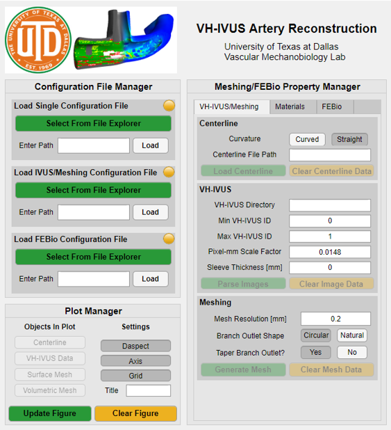
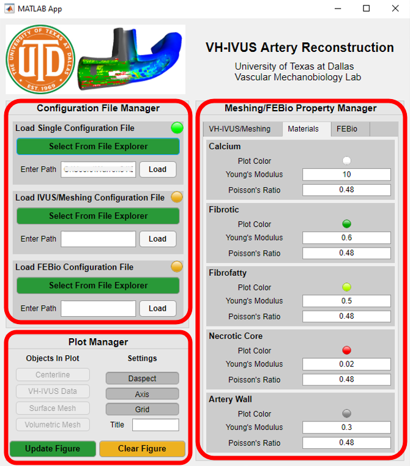
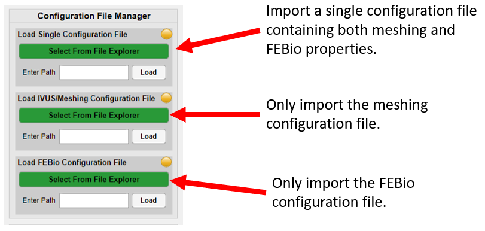
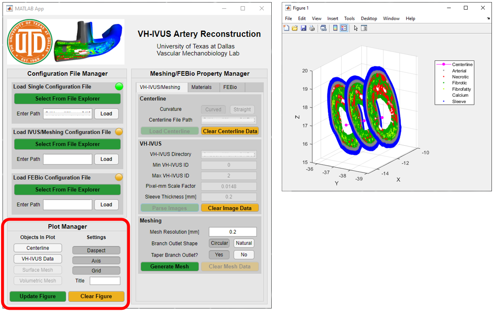
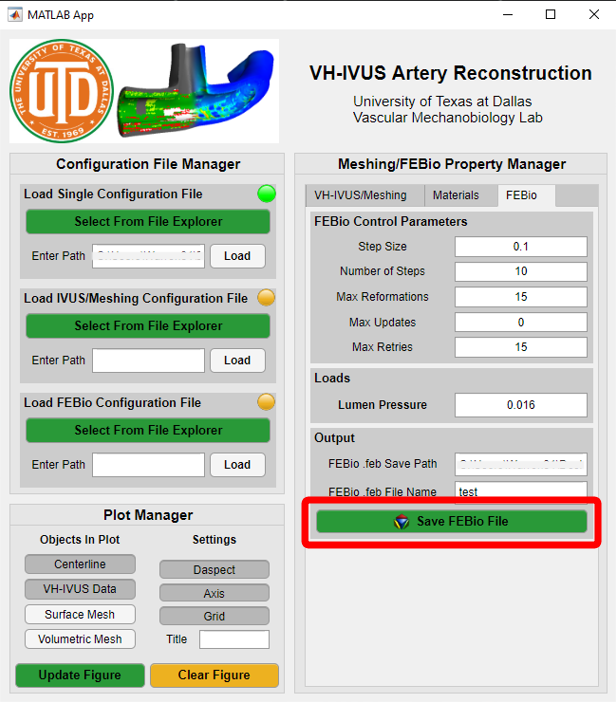

# IVUS to geometry with MATLAB

## Overview
The collection of scripts in this repo are used to generate arterial geometry from patient-specific VH-IVUS images and angiogram data. They were developed in the Vascular Mechanobiology Lab (VMBL) at UTD for the FSABM project to investigate stresses and strains associated with the growth and development of atherosclerotic plaques.  The code works with MATLAB 2019 and newer so make sure to have an updated version of MATLAB already installed on your machine.

## Pre-installation
Before downloading the repository, please make sure you have the following add-ons installed in your MATLAB Add-Ons:
- `ini2struct` by "freeb"
- `Image Processing Toolbox` by "MathWorks Toolbox"
- GIBBON library found here: https://www.gibboncode.org/Installation/

## Usage
### Input Parameters
Make a copy of the `config.template.ini` file and change the name to `config.ini`. This file contains the configuration input used by the code. You can change meshing parameters, paths and directories, or material properties using this file. Additionally, you can use two seperate input files as well. Example seperate config files, `mesh_config.template.ini` and `feb_config.template.ini`, are included in the repository as well.

### Running the Code
The code can be operated 2 ways.
1) Via the user interface (UI)
- Run the `VHIVUSArteryMeshReconstructionApp.m` file in the `\scripts` folder.

	
	
- Three panels contain the buttons and input fields you can use to load, build, and plot your mesh.

	
	
- The Configuration File Manager panel is used to load configuration files for easy model building.

	
	
- The Meshing/FEBio Propertery Manager panel is used to control various VHIVUS, meshing, materials, and FEBio output parameters. These values are automatically filled in from a loaded configuration file.

	
	
- The Plot Manager panel is used to control what is being plotted and plot settings. The plot is updated with these parametes when the `Update Figure` button is pressed. You may notice that some objects are disabled, these are automaticlaly enabled/disabled when they are created from the Meshing/FEBio Property Manager.

	
	
- Once satisfied with the mesh, you can output an FEBio .feb input file using the FEBio Tab in the Meshing/FEBio Property Manager.

	

2) Scripting
- Open the `IVUS_to_FEA.m` file in the `\scripts` folder. This script contains the same functions used in the UI to read the config files, generate the mesh, and output the FEBio .feb input file.

## Data Usage
An example VH-IVUS data set has been included for testing. **NOTE** These images are public data and do not contain any patient-specific information.
